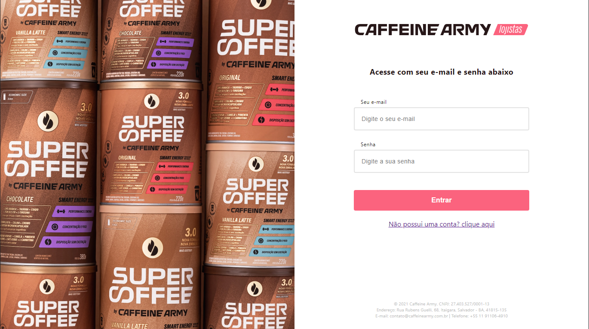
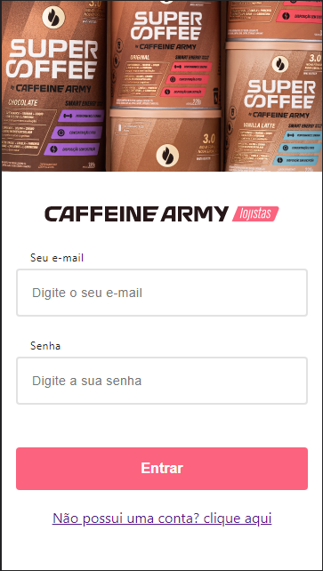
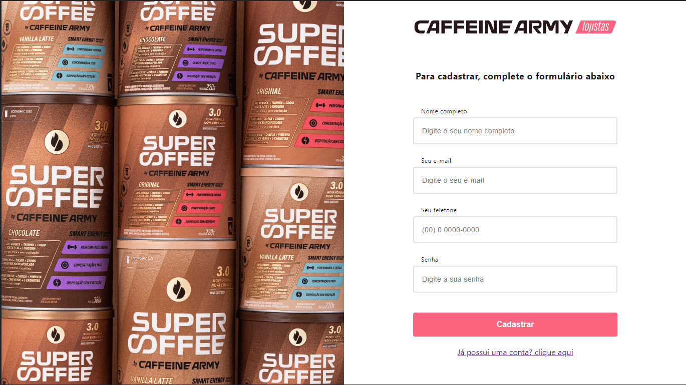
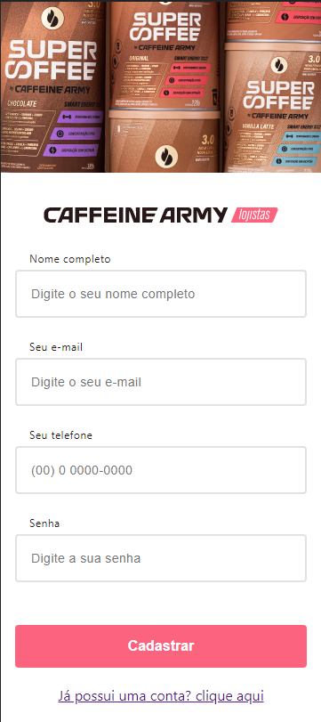
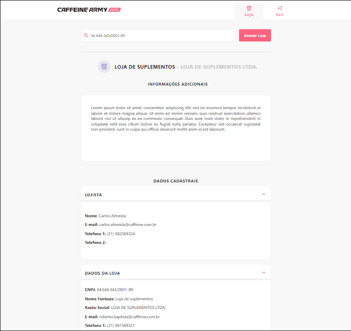
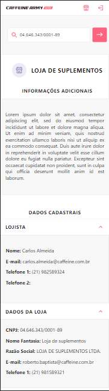

# Caffeine Army - Front

Aplicação criada para facilitar o uso da API que fornece a loja cadastrada associada ao usuário autenticado.

## Funcionalidades

- Autenticação
- Busca pela loja através do cnpj (cadastrado no banco de dados)

## Demonstração








## Variáveis de Ambiente

Para rodar esse projeto, você vai precisar adicionar as seguintes variáveis de ambiente no seu .env

`ENVIROMENT`

Caso queira fazer chamadas api para o docker, é necessário mudar o valor do ENVIROMENT de production para quaisquer outro valor, como por exemplo: development.

## Inicialização

Para instalar as dependências utilize:

```bash
  npm install
```

Para iniciar o projeto

```bash
  npm start
```

## Stack utilizada

**Front-end:** React e Javascript.
